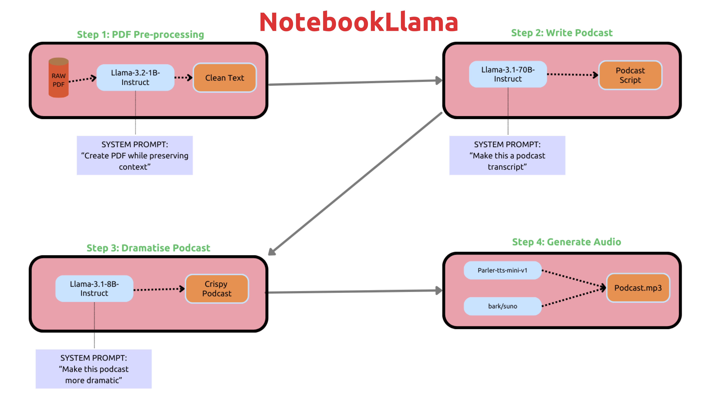

# NotebookMLX

> [meta-llama/NotebookLlama](https://github.com/meta-llama/llama-recipes/tree/main/recipes/quickstart/NotebookLlama)

I ported [NotebookLlama](https://github.com/meta-llama/llama-recipes/tree/main/recipes/quickstart/NotebookLlama) and
implemented it with [MLX](https://github.com/ml-explore/mlx) 🔥

It uses [mlx-community/Qwen2.5-1.5B-Instruct-bf16](https://huggingface.co/mlx-community/Qwen2.5-1.5B-Instruct-4bit) for
pre-processing the
PDF, [mlx-community/Qwen2.5-14B-Instruct-4bit](https://huggingface.co/mlx-community/Qwen2.5-14B-Instruct-4bit) for
creating
transcripts, [mlx-community/Qwen2.5-7B-Instruct-4bit](https://huggingface.co/mlx-community/Qwen2.5-7B-Instruct-4bit) for
rewrites, and [lucasnewman/f5-tts-mlx](https://huggingface.co/lucasnewman/f5-tts-mlx) for Text-to-Speech ⚡

> Citing the NotebookLlama outline.
> 

[Step 1](Step-1-PDF-Pre-Processing-Logic.ipynb): Pre-process PDF:
Use [mlx-community/Qwen2.5-1.5B-Instruct-bf16](https://huggingface.co/mlx-community/Qwen2.5-1.5B-Instruct-4bit) to
pre-process the PDF and save it in a .txt file.

[Step 2](Step-2-Transcript-Writer.ipynb): Transcript Writer:
Use [mlx-community/Qwen2.5-14B-Instruct-4bit](https://huggingface.co/mlx-community/Qwen2.5-14B-Instruct-4bit) to write a
podcast transcript from the text.

[Step-3-Re-Writer.ipynb](Step-3-Re-Writer.ipynb)Step 3: Dramatic Re-Writer: Use
the [mlx-community/Qwen2.5-7B-Instruct-4bit](https://huggingface.co/mlx-community/Qwen2.5-7B-Instruct-4bit) model to
make the transcript more dramatic.

[Step-4-TTS-Workflow.ipynb](Step-4-TTS-Workflow.ipynb)Step 4: Text-To-Speech Workflow: Use [lucasnewman/f5-tts-mlx](https://huggingface.co/lucasnewman/f5-tts-mlx) to generate
a conversational podcast.